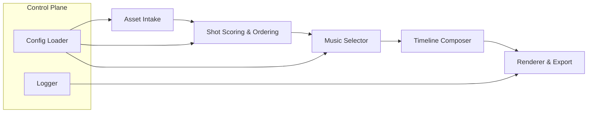

# Architecture & Delivery Plan

_Last updated: 2026-04-13_

## 1. Purpose

Build a reproducible pipeline that ingests pre-labeled footage, scores and orders clips, auto-selects background music, and exports a ready-to-review MP4 without human intervention. This document sets the technical boundaries, component map, and execution milestones for the MVP.

## 2. Goals vs. Non-goals

### Goals

1. Single command to turn a prepared asset folder into a rendered draft video.
2. Deterministic ordering based on explicit rules (later replaceable by ML scoring).
3. Music selection that respects project tempo/mood metadata and outputs normalized loudness.
4. Transparent logging + config snapshot so every frame in the output can be traced back to an input rule.

### Non-goals (Q2 2026)

- Publishing, scheduling, or multi-account management.
- Online editing UI. Output is a file + metadata, not a hosted experience.
- Real-time collaboration; pipeline runs on a single machine/process per job.
- Fully automated content QA. Human review remains required before release.

## 3. Assumptions & Constraints

| Topic | Constraint |
| --- | --- |
| Runtime | Python 3.11+, ffmpeg pre-installed and discoverable via PATH. |
| Storage | Local SSD or mounted NAS; expect < 50 GB per batch. |
| Assets | Footage follows naming convention: `<project>__<scene>__<take>__<tag>.mp4`. |
| Config | YAML-based. Defaults live in repo, overrides per job. |
| Throughput | Minimum 3 rendered drafts per day on a single workstation. |

## 4. System Overview



### Component Responsibilities

1. **Asset Intake**
   - Validate directory structure, detect missing footage/music.
   - Parse naming schema into structured metadata (scene, take, camera, mood tags, length).
   - Extract technical properties via ffprobe (fps, resolution, codec).
2. **Shot Scoring & Ordering**
   - Apply filtering rules (e.g., drop takes marked `_NG`).
   - Score each shot (length compliance, tags, optional motion/contrast heuristics).
   - Build ordered timeline and transitions list.
3. **Music Selector**
   - Query music library manifest (CSV/YAML) filtered by BPM, mood, duration.
   - Trim or loop tracks to fit timeline; produce gain envelope to avoid clipping.
4. **Timeline Composer**
   - Calculate clip in/out points, transitions, overlays, subtitles (placeholder for later).
   - Emit intermediate JSON/EDL that renderer consumes.
5. **Renderer & Export**
   - Use moviepy + ffmpeg to assemble timeline and render to MP4.
   - Persist logs, checksum of inputs, final config snapshot, and lightweight preview GIF.

## 5. Configuration Surfaces

```yaml
job:
  name: sample_mountain_trip
  environment: local
inputs:
  footage_glob: "inputs/raw/mountain_trip/*.mp4"
  music_manifest: "inputs/music/catalog.yaml"
timeline:
  target_duration_s: 90
  transition: crossfade
scoring:
  min_score: 0.4
  weights:
    length: 0.3
    tag_match: 0.5
    motion: 0.2
music:
  bpm_range: [90, 110]
  mood: ["uplifting", "cinematic"]
export:
  resolution: "1920x1080"
  fps: 25
  video_bitrate: "12M"
  audio_lufs: -14
```

All keys must be documented in `docs/pipeline-spec.md`. The loader merges the base config with job overrides and freezes the result for logging.

## 6. Observability & Logging

- **Structured logs**: JSON lines per stage (`stage`, `clip_id`, `event`, `duration_ms`, `metadata`).
- **Artifacts**: store intermediate timeline JSON + final config under `outputs/<job>/`.
- **Metrics**: total runtime, number of clips kept/dropped, audio loudness adjustments, render retries.
- **Failure policy**: fail-fast; stop pipeline on first fatal error, emit `diagnostics.md` in job output.

## 7. Implementation Plan

| Milestone | Deliverable | Owner | Due |
| --- | --- | --- | --- |
| MVP 0.1 | CLI skeleton, config loader, logging utilities. | Core | 2026-04-20 |
| MVP 0.2 | Asset intake + deterministic ordering rules. | Core | 2026-04-27 |
| MVP 0.3 | Music selector + renderer; 3 draft exports. | Core | 2026-05-05 |
| 0.3+ | Pluggable scoring interface (ML ready). | Core | 2026-05-15 |

## 8. Risks & Mitigations

- **Audio clipping / loudness mismatch** → enforce LUFS normalization and envelope smoothing per track.
- **Naming convention drift** → expose schema in config and ship validation script.
- **Performance bottlenecks** → pre-cache metadata, parallelize ffprobe calls, and stream render when possible.
- **Configuration sprawl** → lock config version in every job output, add `pipeline_version` tag for compatibility.

## 9. Next Actions

1. Finalize config schema (`docs/pipeline-spec.md`).
2. Scaffold `src/` packages per component responsibilities above.
3. Prepare tiny demo dataset (5 clips + 2 music tracks) to exercise the flow end-to-end.
